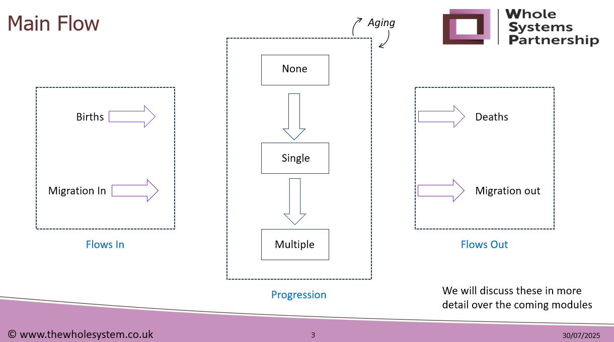
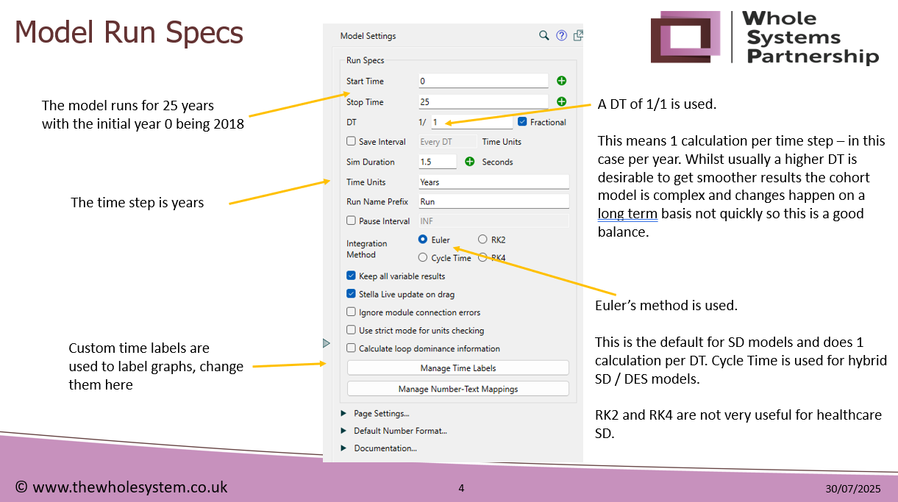

[Kent JSNA Cohort model](https://www.kpho.org.uk/joint-strategic-needs-assessment/jsna-summary/jsna-population-cohort-model) © 2025 by [Kent County Council](https://www.kent.gov.uk/) is licensed under [CC BY-NC-SA 4.0](https://creativecommons.org/licenses/by-nc-sa/4.0/) {style="font-size: 12pt; font-weight: var(--fontWeightRegular); max-width: 1em; max-height: 1em; margin-left: 0.2em;"}{style="font-size: 12pt; font-weight: var(--fontWeightRegular); max-width: 1em; max-height: 1em; margin-left: 0.2em;"}{style="font-size: 12pt; font-weight: var(--fontWeightRegular); max-width: 1em; max-height: 1em; margin-left: 0.2em;"}{style="font-size: 12pt; font-weight: var(--fontWeightRegular); max-width: 1em; max-height: 1em; margin-left: 0.2em;"}

In collaboration with [Whole Systems Partnership](https://www.thewholesystem.co.uk/ "Visit WSP homepage").

# Session 1 - Initial model set-up – model run specs, arrays, initialisation data, initial model calibration.

## Model Architecture and Flow

### Core Structure

The model simulates population health over 25 years starting from 2018, using annual time steps. It tracks individuals across three health states:

-   No conditions
-   Single condition
-   Multiple conditions

Transitions between these states represent disease progression.

### Peripheral Components

Births and migration in feed into the population while deaths and migration out reduce it. An ageing chain runs across the top, incrementing age over time.

{fig-alt="Cohort model main flow simplified overview" fig-align="center"}

### Time Settings

Delta Time (DT) is set to 1 year using ADT (Advanced Delta Time), meaning one calculation per year. Higher DTs (e.g., 1/4) are sometimes used for precision, but DT=1 is sufficient for the cohort model. Furthermore, increasing DTs can increase the running time of the simulation.

### Integration Methods

Euler is the default method used. Alternatives like Cycle Time, RK2, and RK4 are possible. Cycle Time is useful for tracking individual transitions (e.g., waiting times). RK methods are rarely used in this context.

{fig-alt="Model run specification" fig-align="center"}

## Arrays in Stella

### Purpose and Benefits

Arrays allow the model to handle multiple categories (e.g., conditions, age bands, LADs) without duplicating pathways: They enable stratification and scalability. Without arrays, the model would require separate stocks and flows for each category, which is impractical for complex systems.

### Key Arrays Used

-   Conditions: asthma, CHD, COPD, diabetes, heart failure, stroke, SMI, dementia, neuro, LD.
-   Risk Factors: smoking, blood pressure, cholesterol, BMI, physical inactivity, diabetes, loneliness, alcohol consumption, serious mental illness and fuel poverty
-   Demographics: gender, age bands, LADs, IMD quintiles.

### Array Editor

Accessed via Model → Array Editor. Arrays can be labelled (e.g., “Hospital A”) or numbered (e.g., IMD quintiles as 1–5). Numbered arrays allow direct mathematical operations.

### Array Functions

Sum, Min, Max, and Mean can be added via the spanner icon next to array elements. These functions simplify aggregation without needing separate converters.

### Key Learning Points from practical exercises on arrays

Two exercises were done:

Exercise 1 - Adding basic array on a simple hospital model:

1.  In array editor, create an array on hospitals and set the options to Hospital A and Hospital B - you'll need to set indexed to 'Label' and Size to 2.

2.  Highlight all the objects in the model and apply the array to all model elements (stocks, flows, converters). You can do this by highlighting all the elements.

3.  In the equation view you can untick 'apply to all' and then set different values for each of your hospitals.

4.  Use graphs and dropdowns to visualise results per hospital or in aggregate.

Exercise 2 - summing arrayed stocks. The purpose of this exercise was to highlight the importance of understanding which arrays were present in each stock so they could be properly handled when summed in a converter. The SUM function must be used when there is an additional dimension (or array). In the array editor, you can create aggregate values for the arrays by clicking on the spanner icon beside the array dimension. Typically, when adding a graph, you can choose which array dimensions to display. The \* allows you to choose a summary function and the ? allows you to choose the dimension in a drop down in the interface. Note: you may need to add the option as a filter in the interface before you can use it in a graph in the model view.

## Exporting and Importing Data

### Exporting

1.  Choose the table you would like to export. Open the normal side panel for editing and click Mark for export and name the table. Set the orientation.

2.  Create a blank Excel file locally (not on OneDrive/SharePoint).

3.  Use Model → Export Data, add a link to the local Excel file. Set the data source to the table you want to export, choose “on demand” mode to avoid dynamic linking issues. Select Use Table Settings in the Export Interval.

4.  Click on the document icon in the Export field in the Export Links box to complete the export.

### Importing

1.  Modify values in the exported spreadsheet

2.  Use Model → Import Data and find your file.

3.  Set parameters to overwrite existing values.

Tips - Use “Make Template” to generate a full import sheet. Be cautious with version control—avoid overwriting correct values with outdated ones.

## Initialisation Data

The key data sources used to initialise the model are as follows: - Births - Deaths - Migration: Annual numbers from the Housing Led Projections. - IMD quintiles import - IMD quintiles by LAD - IMD quintiles by condition - IMD Death ratio - CMD: Generic prevalence of Common mental health Disorders by Age, Gender, IMD - Covid: Evidence collected during COVID19 to calculate proportions at risk and mortality - Ethnicity: Ethnic make up by LAD – used for scenarios (e.g. Health Checks) only.

### How Data Feeds the Model

Population data is fed into the 3 corresponding graphical converters. These initialise the population and provide the baseline for the calculated projections.

Prevalence of conditions are set in the converter `Cohort rate single`, and are used to initialise stocks. These rates are arrayed by gender and age band.

## Navigation and Debugging

Finding Elements - Use Find → Arrayed by to locate where arrays are used. - Use Find → Variable Name to locate specific converters or stocks. - Use Causes/Uses to trace dependencies and relationships.

Ghosting Ghosted elements are visual duplicates used to simplify layout. They retain full functionality and are linked to the original.

# Session 2 - Calculation and use of risk factors including IMD

## Session Purpose

This session focused on understanding how risk factors are represented and manipulated within the Kent JSNA cohort model. The goal was to clarify how these inputs influence health outcomes and model flows, particularly in the context of scenario testing and targeted interventions.

## The big picture

Mark: This is an oversimplification but I think some modified version of it will be helpful to keep in tact:

1.  The model simulates core population dynamics, including **births, ageing, migration and deaths**, across time steps.
2.  At each time step, the model calculates disease incidence and mortality using fixed rates stratified by age, gender, and condition.
3.  In the model, 'risk' is based on primary preventative factors such as smoking, total cholesterol, systolic blood pressure, body mass index, physical inactivity and alcohol consumption. It is important to remember that all the calculations in the cohort model are based on the whole population, not a small cohort.
4.  Long-term trends in these risk factors can be set to reflect changes over time. This alters the size of subgroups within the population who exhibit these risks.
5.  These subgroup populations can be further modified by interventions aimed at reducing the prevalence of the same risk factors.
6.  Once the size of each risk group is determined, risk ratios are applied to adjust incidence rates (or disease transition rates) at the **population level**.
7.  Need to add something on relative risk reduction calculations ...

Heather's interpretation:

1.  The model simulates core population dynamics, including births, ageing, migration and deaths, across time steps.
2.  At each time step, the model calculates disease incidence and mortality using fixed rates stratified by age, gender, and condition.
3.  In the model, 'risk' is based on primary preventative factors such as smoking, total cholesterol, systolic blood pressure, body mass index, physical inactivity and alcohol consumption. It is important to remember that all the calculations in the cohort model are based on the whole population.
4.  The relationship between every risk factor and condition is defined by the risk ratios. For example, the risk ratio for smoking x asthma is 1.5, indicating that smokers have 1.5x the risk of asthma as non-smokers.
5.  These ratios are then used to calculate the population attributable fraction - that is, the proportion of the cases of each condition in the population which are caused by that risk factor.
6.  Long-term trends in these risk factors can be set to reflect changes over time and interventions aimed at reducing the prevalence of the same risk factors can be applied.The percentage set here is the actual change in prevalence, not a proportional change in prevalence e.g. reducing smokers from 20% to 15% would be a 5% reduction.
7.  The PAF which would have been caused by the percentage reduction in the risk factor prevalence is subtracted from 1 to create the leftover prevalence of the condition, and that proportion acts on the incidence rate elsewhere in the model, alongside other factors. The PAF flow is further explained in the images below.
8.  Something important to note is that there is no baseline prevalence of any risk factor, so you could reduce the risk factor to a prevalence which is impossible in reality. You should consider the prevalence of a risk factor from published materials before reducing it in the model.

::: {layout-ncol="2"}
{fig-alt="Cohort model PAF explanation"}

{fig-alt="Cohort model PAF risk flow"}
:::

## add explanation of the regression modelled risk factors

## Risk Factors in the Interface

### Structure and Navigation

-   The **Risk Factors** section of the model interface includes two key components:
    -   **Trend data** sourced from the Health Survey for England, displayed as annual compounded changes.
    -   **Risk ratios** used directly in the model, stratified by **condition** and **gender**.
-   Users can switch between different risk factors using dropdown menus and view how each affects specific health conditions.

### Functional Role in the Model

-   Risk ratios are used to **adjust transition probabilities** between health states (e.g., from no condition to single condition).
-   These ratios are applied **uniformly across the population**, meaning any change affects all individuals equally, regardless of subgroup.

## Model Behaviour and Limitations

### Sensitivity to Inputs

-   The model is designed to simulate **realistic population-level dynamics**, not extreme or edge-case scenarios.
-   Applying extreme values (e.g., 0% or 100% risk) can cause the model to **fail or behave unpredictably**, as it lacks built-in constraints for such cases.
-   In practice, users should avoid pushing parameters beyond plausible bounds and consider adding **catch mechanisms** if needed.

### Population-Level Assumptions

-   The model assumes that any intervention (e.g., smoking cessation) is **dispersed across the entire population**.
-   This means that even if an intervention targets a small group, its effect is **diluted** when applied at scale.
-   This can be counterintuitive when modeling **high-impact, low-coverage interventions**, as the model does not natively support granular targeting.

## Targeted Interventions

### Workarounds and Approximations

-   Although the model is not arrayed by **Index of Multiple Deprivation (IMD)** or other fine-grained subgroups, users can simulate targeted interventions by:
    -   Estimating the **percentage of the population** affected.
    -   Applying the intervention proportionally (e.g., 0.002% for a small cohort).
-   This approach was used in the **Health Checks module**, where a targeted intervention was modeled by adjusting the affected population share.

### Array Capabilities

-   The model supports arraying by **age** and **sex**, allowing for stratified interventions across these dimensions.
-   For other dimensions (e.g., IMD), users must manually calculate and apply proportional effects.

## Conceptual Clarifications

### Uniform Risk Reduction

-   When a risk factor is changed, the model assumes a **uniform reduction in risk** across all individuals.
-   This means that even if IMD stratification is applied later, the **relative distribution** of risk remains valid, as all groups have experienced the same proportional change.
-   This logic supports the use of post-adjustment stratification without invalidating the model’s internal consistency.

# Session 3 - Ageing chain and mortality rates

## Session Purpose

This session explored the use of **ageing chains** and **mortality rates** in the Kent JSNA cohort model, with additional context on how **COVID-19 impacts** were integrated into the model architecture. The aim was to deepen understanding of how age progression and disease-related mortality are represented, and how external events like COVID can influence long-term health risks.

## Ageing Chains and Cohort Progression

### Age Band Structure

-   The model uses an **ageing chain** to simulate individuals moving through age bands over time.
-   Age bands are defined using the age array which runs through the whole model.
-   The 'cohort lengths' converter specifies the length of each age band (e.g. 2 years for ages 0–2, 10 years for ages 30–39).
-   This allows for variable cohort durations, which reflect real-world demographic or policy structures (e.g., educational stages).

### Transition Logic

-   Individuals age up based on the formula:\
    **Outflow = Stock / Cohort Length**
-   For example:
    -   In a 2-year cohort (e.g., ages 0–2), 50% of the population ages up each year.
    -   In a 10-year cohort (e.g., ages 30–39), 10% ages up annually.
-   This approach models average transitions, not individual-level distributions.
-   This doesn't apply to the final age band, 85+, which has a different formula.

### Formula Behaviour

-   The inflow to the next age band subtracts 1 from the array index to align with the correct age progression.
-   This subtraction is necessary due to how arrays are indexed and how age transitions are calculated in Stella.
-   The model runs with a Delta Time (DT) of 1 year, meaning transitions are calculated annually.

### Upper Age Band Logic

-   A common question is whether everyone dies at age 95.
-   In the current model, individuals age out of the final age band after a specified average duration.
-   This does not mean all individuals die at the same age; rather, the model applies a decay function based on average survival of 10 years from age 85.
-   This is typical of aggregate system dynamics models, where:
    -   Individual variation is not explicitly modeled.
    -   Population-level averages drive transitions and outflows.

### Conceptual Clarification

-   Unlike agent-based models, which apply distributions to individuals, this model uses average-based flows.
-   The final age band behaves like any other stock:
    -   Individuals enter, remain for an average duration, and then exit (representing death).
-   The model does not require a hard-coded mortality age; instead, it uses flow rates to simulate ageing out.

## Demonstration Model

### Example Setup

-   A simplified model was built using:
    -   A **stock** called `People`, initialised with 5 individuals aged 0.
    -   An **array** of 25 numbered age bands (`0–24`).
    -   All other age bands were initialised to 0.
-   **Inflow** and **outflow** connectors were added:
    -   **Outflow** formula: `Stock / Cohort length`
    -   **Inflow** formula: `Outflow from previous band (index - 1)`
-   The model was run with a **DT of 1 year**, showing individuals ageing up annually until they exit the final band.

## Mortality and COVID-19 Impacts

### COVID-Specific Model Adjustments

-   During the pandemic, a **dual structure** was used, which is reflected in the second copy of the main spine of the model:
    -   Individuals infected with COVID either exited the model via **mortality flows** or transitioned to a **post-COVID stock**.
    -   Recovered individuals were assigned **elevated risk ratios** for the following conditions: coronary heart disease, heart failure, stroke, diabetes.
-   COVID was treated as a **risk factor**, increasing long-term health risks even in the absence of other conditions.

The second version of the model was originally created by copying the entire model to compare pre- and post-COVID scenarios. The main model now includes COVID adjustments, and the duplicate is largely for reference. COVID-specific parameters (e.g., infection rates, risk adjustments) may be outdated and should be updated or removed as appropriate for future use. Now the effects of COVID are probably 'baked in' to any reported prevalence estimates so if these were updated we may be able to strip out the COVID components.

### Evidence-Based Risk Adjustments

-   Published research supports increased risk of cardiovascular disease post-COVID.
-   The model incorporated this by adjusting the **risk ratio converters** for recovered individuals, which is approximately 50% of the population.

### Behavioural and Systemic Effects

-   COVID led to worsening health behaviours, which were captured in the model using by increasing the prevalence of the following risk factors: smoking, alcohol consumption, physical activity and obesity.
-   These behavioural changes were modeled as **time-varying inputs**, whereby the increase is only temporary and tails off over time.

### Prevention and Backlog Effects

-   Reduced access to primary and secondary prevention services (e.g., health checks) during COVID was modeled as a temporary reduction in preventive flow rates.
-   This created a backlog effect, increasing future risk levels due to missed early interventions.
-   The model includes delayed flow components to simulate this backlog and its impact on population health.

## Long-Term Considerations

-   The model captures both **direct impacts** (e.g., increased mortality) and **indirect impacts** (e.g., elevated risk ratios, behavioural changes).
-   There is ongoing uncertainty about whether the population has returned to a new normal or whether residual effects continue to influence health outcomes.
-   Components such as Post-COVID Risk Adjustment and Long COVID Prevalence may require review and updating based on new evidence.

## Next Steps

-   Future sessions may revisit the COVID module and explore how to update assumptions based on more recent data.
-   Continued review of post-COVID health trends will help refine risk factor modeling

# Session 4 - Interventions on healthy behaviour change: generating what-if scenarios

## Overview

The session covered the two main types of interventions and how to implement them in the model:

1.  Trends

2.  What if scenarios. More on these in future sessions.

## Modifying trends in risk factors

There are two main methods:

1.  Risk factor input page on model interface (easiest quick option)

2.  Export values from converter 'Risk reduction annual' to Excel, edit then re-import. This takes a bit longer but has some distinct advantages: a) allows for bulk changes, b) keeps a record of changes made for reproducibility, and c) can be done programmatically (in theory) using R.

### Detailed step by step instructions for exporting data from the model to Excel

1.  Create a blank table in model design screen
2.  Drag and drop Risk reduction annual converter into the table
3.  Change orientation to horizontal
4.  Tick the box 'Mark for Export'
5.  Assign a name to the table
6.  Necessary to run the model once to generate the export file
7.  From menu bar, select Model --\> Export Data ...
8.  In Model Exports screen under 'Destination', select an existing Excel file created in advance for this purpose.
9.  Select an existing worksheet
10. In Model Exports screen under 'Data source', select the table you created
11. Set link type to 'On demand'
12. When ready to export, click on the 'Export' icon from the table above. Just clicking OK does not run the export. It only saves the settings from the export process.
13. Open the Excel file and edit the values as needed. The same values are repeated for each year of the model run so only the first column needs to be retained.

To re-import the edited values back into the model:

1.  Save the edited values in a new Excel file or a new worksheet within the same file

2.  From menu bar, select Model --\> Import Data ...

3.  In Model Imports screen under 'Source', select the Excel file

4.  Select the worksheet containing the edited values

5.  Set link type to 'On demand'

6.  Set import behaviour to 'Set parameters'

7.  Click ok to save the import settings

8.  When ready to import, open the same dialog box again and click on the 'Import' icon from the table above.

::: callout-note
## Trend values are static

Note that risk factor trend values are static and applied consistently across all 25 years of the model run. This requires further consideration because it is unlikely to happen within the population. The rate of change should probably reduce over time.
:::

## Implementation in the model

The rest of the session explored how risk reduction is implemented in the model, particularly focusing on smoking, blood pressure, cholesterol, and other risk factors. The discussion covered cumulative logic, interface switches, population-level assumptions, mortality modelling, forecasting horizons, and the scope of prevention modelling.

## Key Concepts & Model Mechanics

### Interface Switch & Stock Logic

-   A toggle on the interface activates the risk reduction logic.
-   When turned on, values are pulled from inputs and added to a stock annually.
-   This cumulative approach means the effect grows over time rather than remaining static.

### Three Scenario Approaches

-   Static Value: A fixed annual reduction (e.g., 0.006) applied each year.
-   Cumulative Stock: The same value added to a stock, resulting in growth year-on-year.
-   Time Series Input: A graphical input that varies over time, allowing dynamic reductions.

### Model Behavior

-   The model does not track subgroups (e.g., smokers vs. non-smokers).
-   It applies reductions universally, assuming a percentage reduction in risk, not prevalence.
-   This can lead to misleading results if not carefully calibrated (e.g., reducing smoking by 50% when only 11% smoke).

## Clarifications & Misunderstandings

-   Risk vs. Prevalence: The model reduces risk, not the number of people with the risk factor.
-   No Negative Values: The model doesn’t allow risk to go below zero, but it doesn’t inherently know the starting prevalence.
-   Cumulative Risk Reduction: Over long periods, cumulative reductions can exceed realistic bounds if not sense-checked.
-   Smooth Function: Used to avoid jagged stepwise increases in cumulative reductions, creating a more realistic curve.

## Additional Modules & Flexibility

-   Alternative Scenarios: There is an additional reduction page in the interface for blood pressure, cholesterol and smoking.
-   Blanket Reductions: Apply uniform reductions across the population without gender or age specificity.
-   Interface Switches: Each risk factor (e.g., smoking, blood pressure) can have its own switch and converter.

### Risk Factor Application

-   Smoking: Reduction values (e.g., 0.5%) are applied annually across the population.
-   Blood Pressure & Cholesterol: Applied as unit changes (e.g., mmHg) across the population.
-   Population-Level Impact: These changes affect incidence rates for conditions based on age and gender arrays.
-   Interdependencies: The model does not automatically link changes in one risk factor to others, which may lead to under- or over-estimation of effects.

## General group discussion about the model

### Diagram Walkthrough (Heather)

-   The model spine includes birth, migration, death, single condition, and multiple condition flows.
-   Risk factors modify the rate of flow between these states.
-   All risk adjustments are multipliers on the incidence rate.

### Worked Example: Smoking & Asthma

-   30% of population smokes; risk ratio for asthma is 1.5.
-   PAF formula calculates 13% of asthma cases attributable to smoking.
-   A 5% reduction in smoking leads to 2.4% fewer asthma cases.
-   Final incidence rate is multiplied by 0.976 to reflect this change.

### Mortality Modelling

-   Mortality Rates: Applied to each stock based on LAD, gender, and age band.
-   Condition-Specific Mortality: Not explicitly modelled unless manually adjusted.
-   Cause of Death Categories: Cancer, CVD, respiratory, and other.
-   Prevalence Calculation: Based on live population in single + multiple condition stocks.
-   Potential Calibration: Adjustments could reflect higher mortality for severe conditions.

### Forecasting Horizon & Uncertainty

-   Current Horizon: 25 years — early years are more reliable.
-   Sensitivity Testing: Apply variation to flows and run multiple simulations.
-   Scenario Testing vs. Forecasting: Best used for comparing interventions, not predicting exact future outcomes.
-   Caveats: Important to communicate uncertainty and avoid overinterpreting long-term projections.

### Risk Factors Included

-   Current smoking
-   Ex-smoking
-   Blood pressure
-   Cholesterol
-   BMI
-   Physical inactivity
-   Diabetes
-   Fuel poverty
-   Severe mental illness (SMI)
-   Adverse childhood experiences (ACE)
-   Severe multiple disadvantage (SMD)
-   Loneliness
-   Alcohol

### Reflections & Emotional Insights

-   Frustration at complexity and cumulative logic.
-   Desire for simplified explanations and visual aids.
-   Concerns about double-counting effects.
-   Suggestion for safety checks or visual summaries.
-   Feedback welcomed to improve future training.

## Key Takeaways

-   Two main ways to apply additional scenarios:
    1.  Import new trends by gender, age, and risk.
    2.  Apply blanket reductions across the population.
-   The model is flexible but requires careful interpretation.
-   Visual walkthroughs and worked examples are helpful.
-   Best used for scenario testing (and comparison), not long-term forecasting of precise numbers.

# Session 5 - NHS Health Checks module

## Overview

-   The aim of the NHS Health Checks module is to explore the effect that the NHS Health Check programme has on the flow of people from the healthy (none) stock into the single and subsequently multiple condition stocks.

-   Interventions resulting from NHS Health Checks considered in the model are: smoking advice, blood pressure therapy, statins for cholesterol, and BMI/weight advice.

-   Evidence from existing literature was used to determine the impact of interventions on reducing risk factors for the health conditions considered in the model.

-   Interventions delay progression from healthy to single condition, which in turn slows progression to multiple conditions. Deaths can occur from any state.

-   Only the 'none' stock (ages 40-74) is entered into the NHS Health Check pathway within the model. The 'single' and 'multiple' condition stocks do not enter the NHS Health Checks pathway. In the real world, some people with single and multiple conditions will be eligible for an NHS Health Check.

-   The model diagram omits births and migration for simplicity but these dynamics are present in the background of the simulation.

-   Aaron mentioned that people could potentially flow back from single to none but I don't think this is correct. He was perhaps talking about real world.

## Scenarios

### Original Scenarios

{fig-alt="Table showing the four NHS Health Check scenarios" fig-align="center"}

-   Scenarios B and C were 'discounted' (assumes this means they were deembed not feasible for real-world implementation) but the logic for them still exists in the model

### Scenarios for NHS Health Check Paper

| **Scenario** | **HC Programme** | **Attendancce** | **Intervention Received** |
|--------------|--------------|---------------------------|-------------------|
| 1 | Run between yr 5 to 9 then stop | n/a | n/a |
| 2 | Run between yr 5 to yr 25 | No change | No change |
| 2 | Run between yr 5 to 9 then stop | No change | No change |
| 4 | Run between yr 5 to 9 then stop | Increase uptake for the most deprived quintile to match the average for the whole of Kent | No change |
| 5 | Run between yr 5 to yr 25 | Increase uptake for the most deprived quintile to match the average for the whole of Kent | No change |
| 6 | Run between yr 5 to 9 then stop | No change | Increase intervention received by 50% (BP 50% and cholesterol 22%) |
| 7 | Run between yr 5 to yr 25 | No change | Increase intervention received by 50% (BP 50% and cholesterol 22%) |
| 8 | Run between yr 5 to 9 then stop | Increase uptake for the most deprived quintile to match the average for the whole of Kent | Increase intervention received by 50% (BP 50% and cholesterol 22%) |
| 9 | Run between yr 5 to yr 25 | Increase uptake for the most deprived quintile to match the average for the whole of Kent | Increase intervention received by 50% (BP 50% and cholesterol 22%) |
| 10 | Run between yr 5 to 9 then stop | Increase uptake for Thanet only to match the average for the whole of Kent | No change |

: Scenarios for NHS Health Check Paper {.striped. hover}

-   The model allows for scenario-specific boosting of attendance and intervention rates by IMD quintile, ethnicity, and LAD. Historical attendance data by LAD, gender, and age band is used to set baselines, and scenario switches on the interface enable users to adjust these parameters for targeted analysis.

### Data Inputs for Scenarios

-   Historical attendance rates by LAD, gender, and age.
-   IMD composition of each LAD.
-   Ethnicity ratios for IMD 1 (most deprived).
-   Risk factor prevalence by IMD, gender, LAD and age.
-   Intervention rates for each risk group (e.g., percent of smokers receiving advice).
-   Effectiveness of interventions - some sources were unclear or based on best estimates.

## Module Structure

-   A converter identifies the eligible age range (40–74).
-   The healthy population ('None' stock) is filtered by age to determine the eligible pool.
-   The total eligible population is calculated and then split into two stocks: 'eligible but did not attend' and 'eligibile and did attend'. Attendance is calculated according to historic attendance rates arrayed by age and gender.
-   The total elgible and attending is split by ethnicity in a separate stock and flow.
-   Attendance is further split by IMD using LAD-level IMD composition.
-   The IMD adjustment is not a true percentage but an adjustment factor, sometimes exceeding 100, based on best available estimates from NHS Health Check programme data.

### IMD and Ethnicity Adjustments for Scenarios

-   There is a converter for adjusting the percentage attending from different IMD quintiles
-   There is a converter for adjusting the percentage attending from different ethnci groups
-   Controlling these adjustments can be done through switches on the interface

### Risk Factor Integration

-   The total attending arrayed by LAD, IMD, age and gender including any additional from particular IMD quintiles plus additional from particular ethnic groups is multiplied by the prevalence of each risk factor (using the same arrays) to calculate the **number of attendees with each risk factor**. -For each risk group, the model applies the percentage receiving the intervention (e.g., 80% of smokers receive advice).
-   The effectiveness of each intervention is then applied, some values (e.g., 0.085 for smoking, 15 for BP) are not well-documented and may represent different concepts (e.g., success rate vs. risk reduction).
-   The model multiplies the number of attendees with a risk factor by the intervention rate and effectiveness to estimate the number of successful interventions.
-   **Risk ratios for NHS Health Checks are not the same as risk ratios used in the core model**
-   **Risk reduction for all risk factors is calculated using PAF.** This is due to the values used for effectiveness of interventions in the 'NHS Health checks impacts risk factors' converter.
-   'NHS Health checks effectiveness' converter has a value of 0.5 for blood pressure and cholesterol because there is evidence to suggest that people do not adhere to their medication regime.

### Intergration With Core Stocks and Flows

-   The reduction in each risk factor as a result of NHS Health Checks is multiplied together to calculate a total risk reduction that can be applied to the flow from 'None' to 'Single' in the core model stock and flow.

## Running Scenarios and Model Interface

-   Two main switches on the interface: one is the main NHS Health Checks switch, one is for original scenarios B and C. The switches should be used independently.
-   For modelling different scenarios, turn on the main switch 'Switch NHS Health checks' and then adjust the values in the boxes on the interface. Keep the second switch turned off.
-   If the main switch is turned on, other switches in the model (e.g. additional risk reduction in the local authority impacts section) should not be turned on.
-   A value of between 0 and 100 should be put into the boxes for increasing percent uptake from particular IMD quintiles.
-   The module’s time logic is hardcoded so that it simulates the NHS Health Checks programme running for 5 years and then ceasing. Manual changes would be needed throughout the module to run scenarios for different durations (e.g., 5 vs. 25 years).
-   Values in 'Baseline treatment received' are the baseline percentages of attendees with the relevant risk factor that receive an intervention e.g. 80% of smokers receive smoking advice

## Limitations, Issues, and Model Maintenance (Aaron, Mark, Heather)

-   The model’s structure does not fully align with real-world eligibility criteria for health checks, particularly regarding which conditions exclude individuals from being eligible.
-   The aggregation of IMD and ethnicity after calculations for risk reduction so that it can be incorporated into the mainmodel flow means the model cannot answer questions about health inequalities or subgroup impacts, which was a concern for commissioners and public health specialists.
-   Some parameters and calculations are not well-documented, and there are inconsistencies in how risk and intervention effectiveness are handled across model sections.
-   The model’s time logic (hardcoded years for health cheque cycles) is cumbersome and should be refactored for easier scenario analysis.
-   There are unused or legacy sections in the model that could be cleaned up.

# Session 7

## Common Mental Disorders (CMD) module

### Overview of the module
This part of the model calculates the number of peope with and without a common mental illness as it's main outputs. In this way, CMD is a condition and not a risk factor. Essentially, there are two stocks - CMD and no CMD - and an intervention which affects the flow between these stocks. The prevalence and risk of CMD is dependent on the outputs of the main model and other demographic data.
The outputs from this section do not feed back into the main model, but they could be exported and then put back in if CMD was decided to be a risk factor for other conditions. The values in this part of the model should be updated and please not that before using it, convertor 48 must have the time bound removed. 

### Model Structure & Initialization:

CMD is modeled as a separate section which operates independently of the main flow. All CMD types are grouped into a single stock - "CMD". The stocks are: "No CMD," "Single CMD," and "Multiple CMD," each arrayed by gender, age band, and condition 

### Initialization data:

- Prevalence of CMD by gender and age band (likely sourced from the Adult Psychiatric Morbidity Survey 2014, but this should be verified and updated) which is then acted on by the following
- CMD/IMD ratio (CMD prevalence by Index of Multiple Deprivation quintile).
- CMD ratio against main conditions in the cohort model.
- Intervention effect (reduction in CMD prevalence, used in scenario analysis).

The populations from the main model are used as the populations here. Then they are acted on to create a stock of people with CMD and a stock without CMD. New cases of CMD are calculated based on these initialisations, allowing for incident case tracking 

### Description of the model
There are two sections:
- on the left, is the version with the interventions (there is an intervention convertor)
- on the right, the baseline is represented

Both work similarly to other model sections - there are flows for migration, an ageing chain, mortality from both CMD and non-CMD stocks, progression from no CMD to CMD. Both use the same underlying logic but allow for scenario comparison (e.g., with and without interventions).

The flows from CMD to No-CMD are bi-flows, which represent the possibility of remission/ allow for recovery from CMD, which is important for modeling episodic conditions.

The left side version of the model has an additional flow - new CND cases impact, which is adjusted by the convertor 48, which works by the convertor CMD interventions and switch mh wellbeing. CMD interventions is currently hardcoded to cause a 50% reduction in CMD incidence.

CMD sector does not feed back into the main cohort model. It is dependent on the main model for population and risk factor changes but does not influence other conditions or overall model dynamics.
The architecture allows for the CMD sector to be extracted and run separately, provided dependencies (e.g., population structure, risk factors) are maintained. This could be useful for focused CMD analysis or if CMD becomes a risk factor for other conditions in future model versions.

## Frailty Module

### Model Structure & Initialization:
Overview: there's two sections. The top one called Frailty calculates prevalences of frailty categories. It doesn't work on flows, it works by applying prevalence estimates to different groups. The levels of frailty are completely dependent on the cohorts in the main spine of the model. This means you can't run an intervention directly on frailty, rather you can run an intervention on one of the model's other conditions and see the effect of that on frailty. There is a frailty module below which shows flows through frailty severity, and can be helpful to show incidence. It uses the outputs of the first frailty section to initialise so it shows for example, how many people might become severely frail, as a result of the prevalence estimates, but not how people who start as mildly frail will progress to severe frailty. 

Frailty is modeled using the Electronic Frailty Index (EFI) data, split into four categories: none, mild, moderate, and severe (categories 1-4). These are arrayed by gender, age, and condition, and are applied separately to the "None," "Single," and "Multiple" condition stocks. Each stock (none, single, multiple) has its own frailty rates, reflecting the increased risk of frailty with multimorbidity.

The initialization uses a large table of assumptions, which have previously been extracted from the model and saved down, specifying the percentage of each cohort at each frailty level by age, gender, and condition. For some cohorts (e.g., heart failure, learning disability), data is sparse or missing, so assumptions are used instead.

The number of frail people coming from each none, single and multiple condition stocks are then added together in the convertor cohort frailty cat, and this is the one that should be used for exporting.

Model Flows & Limitations:
- The model does not generate flows between frailty levels (e.g., mild to moderate) due to circular dependencies with the main cohort stocks. This means interventions cannot directly model transitions between frailty states; instead, changes in risk factors or cohort structure affect frailty prevalence indirectly.
- The model calculates prevalence based on risk factors and cohort changes. If evidence exists for interventions that change frailty rates (e.g., a study showing reduced frailty in a specific cohort), these can be incorporated as changes to the assumptions, not as direct flows.
- The model is best suited for population-level interventions (e.g., reducing risk factors across a cohort, improving cardiovascular health) rather than small-scale interventions (e.g., a single exercise class). The impact of interventions is more pronounced at scale.

## Public Health Outputs
Life Expectancy & Related Metrics:
The model calculates several public health metrics, including:
- YLL = Expected lifespan − Age at death
- TX = The total number of years lived in the future  by all people who are alive at age 𝑥
- EX = Life expectancy at age 𝑥 
- EX0 = Complete life expectancy
- YDL = Years disabled lived
- AX = Expected years further a person aged 𝑥 is expected to live
- LX = Person-years lived between ages 𝑥 and 𝑥+1
- HALE = Healthy Life Expectancy - Average number of years a person is expected to live in good health, based on model stocks and flows (not official ONS methodology).
Other metrics: DX (number dying at age X), QX (probability of dying at age X), used in life table calculations.

Outputs are available by local area, gender, and age band. It has a page on the interface, 'Key outputs': you need to select a district for it to work properly. Results reflect real-world trends, such as the impact of COVID-19 (temporary dip in life expectancy, followed by recovery) and longer-term trends (e.g., stagnation or slow increase in life expectancy). 

Healthy life expectancy is highlighted as a particularly useful metric for communicating with stakeholders, as it combines mortality and morbidity into a single, easily understood measure.

The model's approach allows for scenario analysis and tracking of inequalities (e.g., differences by area, gender, or deprivation). This supports policy analysis and resource allocation.

 
## Final Thoughts 
Model Reading & Modification:
Aaron and Peter recommend starting with looking at stocks, then flows, then converters when analyzing or modifying a new model. Understanding the interface and outputs helps clarify model intent.
Good modeling practice includes using converters for key variables to ensure transparency and ease of modification, though this can make diagrams visually complex.
